# OCI Block Volume Elastic Performance Scaling.

OCI Block Volume has the feature of elastic performance scaling without any down time. This feature helps to scaleup and scaledown block volume performance as and when needed to meet varying workload demands and save cost during off peak workload hours. We are leveraring the Block Volume Elastic performance feature: https://docs.cloud.oracle.com/en-us/iaas/Content/Block/Concepts/blockvolumeelasticperformance.htm to deploy this automatic scaling of block volume performance based on the I/O workload.

## Services and Features Used:

1. OCI FaaS
2. OCI Monitoring 
3. OCI Notification 
4. OCI Block Volume Elastic performance feature.

# Architecture 

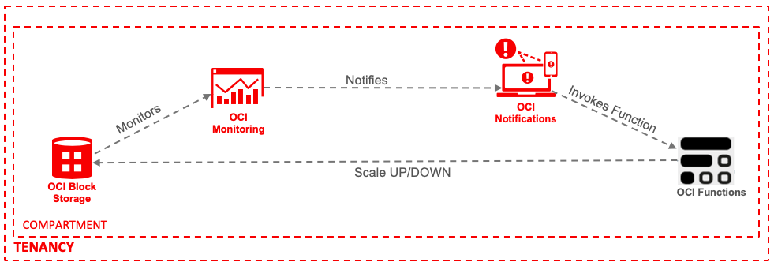

## Implementation Steps

#### 1. Setup your tenancy for OCI Function development and configure your local PC/Laptop/VM for OCI Function development by following: https://docs.cloud.oracle.com/iaas/Content/Functions/Tasks/functionsconfiguringtenancies.htm https://docs.cloud.oracle.com/iaas/Content/Functions/Tasks/functionsconfiguringclient.htm

#### 2. Create an OCI Fn Application(if one doesnt exists) of your desired name(Ex: ONS-Apps)from OCI console by following:https://docs.cloud.oracle.com/iaas/Content/Functions/Tasks/functionscreatingapps.htm#console

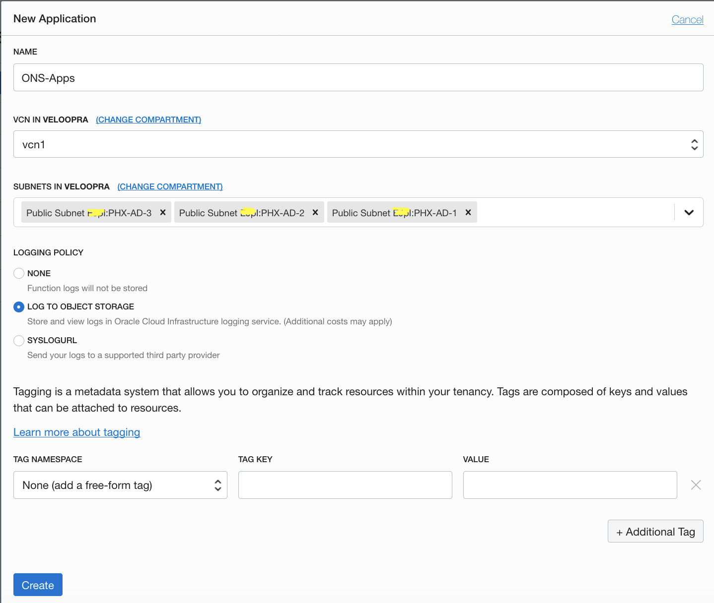

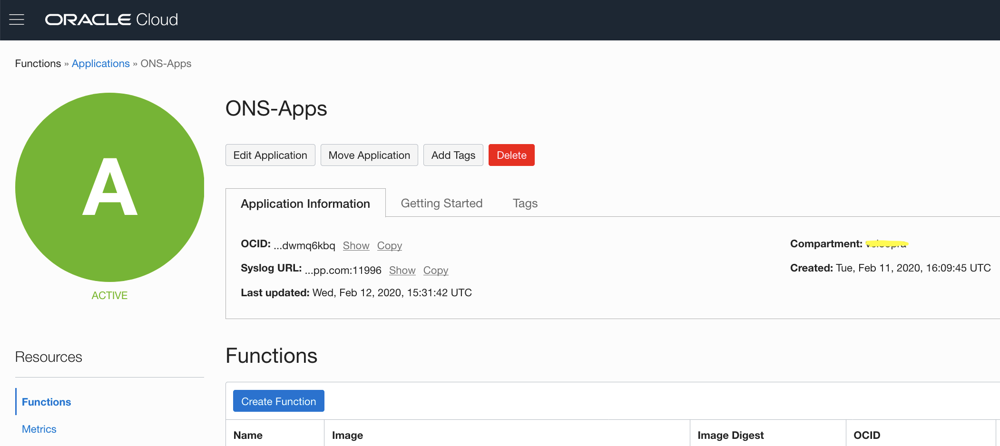

#### 3. Clone/Download this(https://orahub.oraclecorp.com/oracle-functions-samples/oci-bv-performance-scaling.git) github repo into your local Function development directory. 

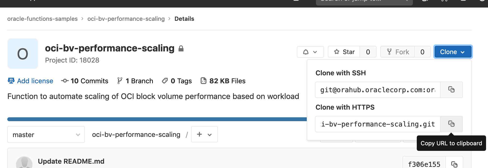

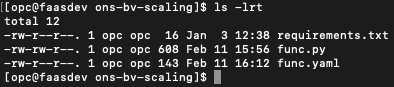

#### 4. From the local Function development directory where the files are downloaded in step 3, initialize and deploy the function to OCI Function service. This step should push the Function image to OCIR service and attach the function to the OCI Function service Application created in step 2.

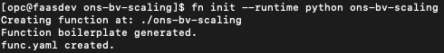

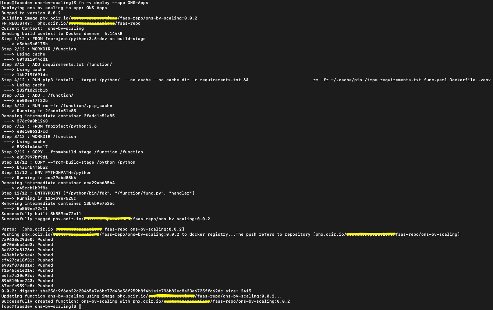

#### 5. Verify that you are now able to see the Function created in previous step is appearing in the OCI Function service Application's console.

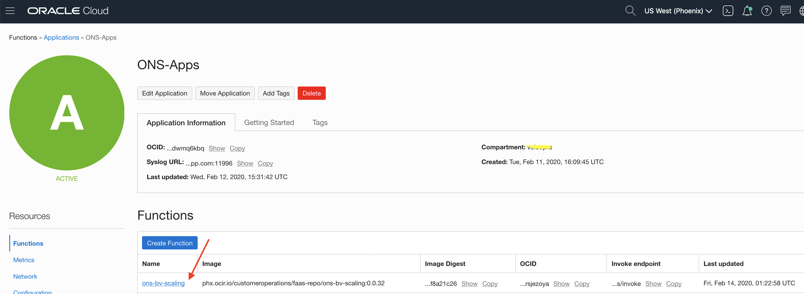

#### 6. Goto the block volume page and verify the current volume size and performance setting.

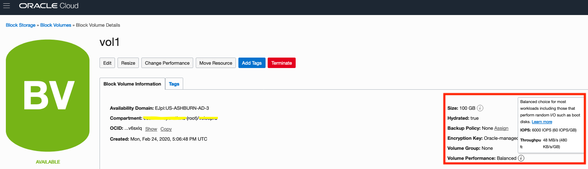

## Some Theory Before the Next Steps:

In this example we have a 100GB volume which is set to Balanced performance mode by default, in this mode it has a max read I/O throughput of 48MB/s. The requirement is that when the read throughput usage is above 48MB/s for more than 5 minutes, the volume should switch to High performance mode. Similarly if the read throughput usage falls below 40MB/s for more than 10mins, the volume should switch back to Balanced performance mode.

In order to achieve above mentioned scaling criteria, we are leveraging the "Volume Read Throughput" metric of the block volume service with metric statistic set to "sum". If the I/O throughput constant usage is at 48MB/s, the 1 minute sum is 2880MB(48MB x 60secs), which is 2880000000 bytes. Similary for 40MB/s the 1 minute sum is 2400000000 bytes. 

We are using above calculated values 2880000000bytes and 2400000000bytes to create 2 alarms difinitions, one for triggering an alarm when the volume throughput usage is above 2880000000bytes and other for triggering an alram when the volume throughput usage goes below 2400000000bytes. Both these alarms can be used to scale up and scale down the block volume between High and Balanced performance modes by coupling the alarms with OCI Notification and OCI Function services.

For the scale up alarm the alarm body has to be configured with the value 20 and for scale down alarm the value should be 10, it will be used as value for the parameter "vpus_per_gb" in the Function code to set the volume performance modes. Reference:https://oracle-cloud-infrastructure-python-sdk.readthedocs.io/en/latest/api/core/models/oci.core.models.UpdateVolumeDetails.html#oci.core.models.UpdateVolumeDetails.vpus_per_gb

#### 7. Create OCI Monitoring alarms to sent notification to perform Block Volume performance scale up/down.

Create an Alarm difinition with alarm body as "20" for block volume scale up and another one with alarm body as "10"for block volume scale down(as per above theory). For both of these Alarms select the same block volume OCID as Dimension Value and "VolumeReadThroughput" as Metric Name. Under the Notification section create an ONS Topic with subscription protocol type as Function and specify the Function created in Step 4.

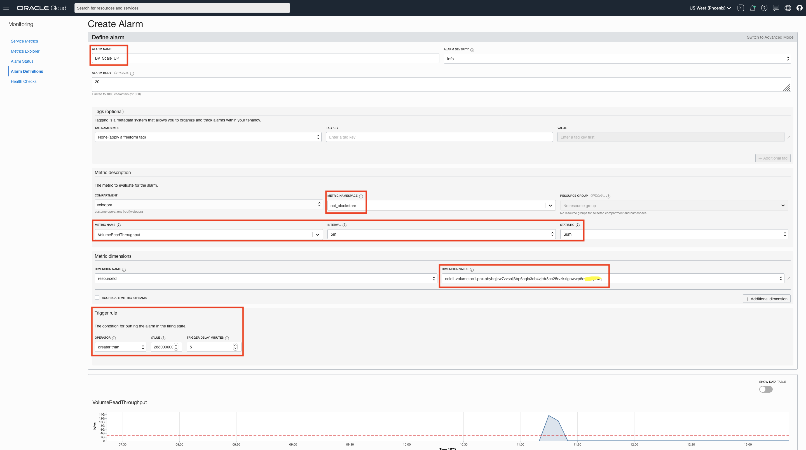

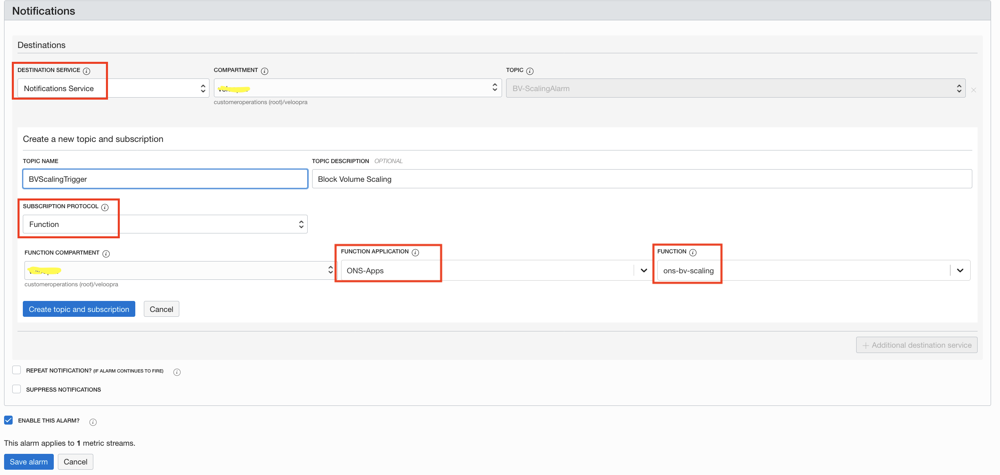

#### 8 Test the Setup.

Run dd or fio from OS to send heavy read operations to the block volume and keep monitoring the "VolumeReadThroughput" metric on Block Volume console, after 5 minutes of max read throughput usage in Balanced performance mode, you can notice that the volume performance mode is changed to High. Similary we can see it changed back to Balanced mode when the throughout usage falls beolow the thrshold set.

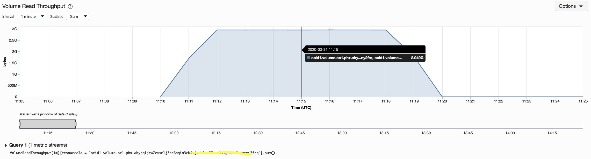

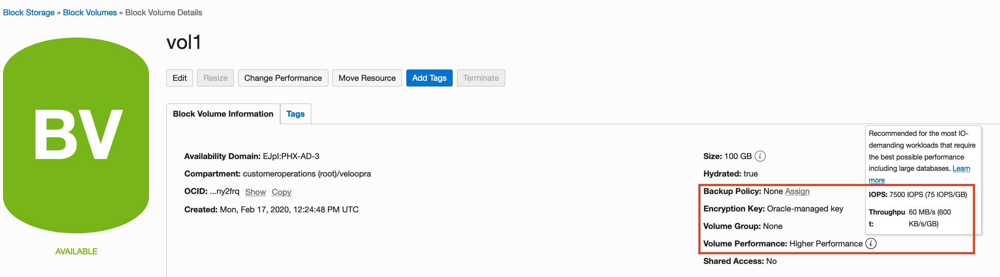

